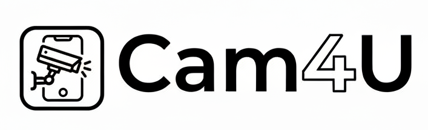

<div align="center">
  
  <h1>Cam4U - Intelligent AI Surveillance System</h1>
  <p>
    <strong>Next-generation, real-time AI object & anomaly detection powered by YOLO and PyTorch.</strong>
  </p>

  <p>
    <a href="#features">Features</a> •
    <a href="#tech-stack">Tech Stack</a> •
    <a href="#getting-started">Getting Started</a> •
    <a href="#environment-variables">Environment Variables</a> 
  </p>
</div>

---

## 👁️ Overview

**Cam4U** is an advanced video surveillance application that seamlessly integrates deep learning models for real-time object tracking and anomaly detection. 
Built with a highly scalable Python/Flask backend and a lightning-fast Next.js dashboard, Cam4U gives users total situational awareness through intelligent, real-time alerts and comprehensive analytics.

## ✨ Features

- 🎥 **Real-time Video Processing**: Instantly process live webcam feeds or uploaded videos.
- 🎯 **Pinpoint Object Detection**: Powered by `YOLO` to accurately detect, track, and classify entities within a frame.
- 🚨 **MIL I3D Anomaly Detection**: Utilizes Multiple Instance Learning (MIL) combined with PyTorch 3D CNNs to automatically flag fights, accidents, and suspicious activities.
- ⚡ **WebSocket Streaming**: Uninterrupted, ultra-low latency data streaming via Socket.IO.
- 📊 **Analytics Dashboard**: Get insight on alerts, events, and metrics via a beautiful, interactive Next.js dashboard equipped with Recharts.
- 📱 **Real-time Alerts**: Instant push notifications to your devices configured via Firebase Cloud Messaging and automated email reports.

## 🛠 Tech Stack

**Frontend:**
- [Next.js 14](https://nextjs.org/) (React)
- [Tailwind CSS](https://tailwindcss.com/) & [shadcn/ui](https://ui.shadcn.com/) (Styling)
- [GSAP](https://gsap.com/) & Framer Motion (Animations)
- Zustand / React Hook Form / Zod

**Backend:**
- [Python 3](https://www.python.org/) & [Flask](https://flask.palletsprojects.com/)
- [Ultralytics YOLO](https://github.com/ultralytics/ultralytics) (Object Detection)
- [PyTorch](https://pytorch.org/) (MIL I3D Anomaly Detection)
- [OpenCV](https://opencv.org/) (Computer Vision)
- [Flask-SocketIO](https://flask-socketio.readthedocs.io/) (WebSockets)

**Database & Cloud:**
- MongoDB (Database)
- Firebase Admin (Auth & Push Notifications)
- Cloudinary (Media Storage)

## 🚀 Getting Started

### Prerequisites

Ensure you have the following installed on your machine:
- Node.js (v18+)
- Python (3.9+)
- FFmpeg (for video processing)

### 1. Clone the repository

```bash
git clone https://github.com/Vijay-1807/Cam4U.git
cd Cam4U
```

### 2. Backend Setup

Open a terminal and navigate to the backend directory:

```bash
cd backend

# Create a virtual environment
python -m venv venv

# Activate virtual environment
# Windows:
venv\Scripts\activate
# Mac/Linux:
source venv/bin/activate

# Install dependencies
pip install -r requirements.txt

# Run the Flask API & Socket server
python app.py
```

### 3. Frontend Setup

Open a new terminal and navigate to the root directory (or `frontend` if separated):

```bash
# Install NPM packages
npm install

# Run the Next.js development server
npm run dev
```

The frontend will be available at `http://localhost:3000` and the backend will run on `http://localhost:5000`.

## 🔐 Environment Variables

You will need to create a `.env.local` file in the root for the frontend, and a `.env` file in the `backend` folder.

**Frontend (`.env.local`) Example:**
```env
NEXT_PUBLIC_API_URL=http://localhost:5000
NEXT_PUBLIC_FIREBASE_API_KEY=your_api_key
NEXT_PUBLIC_FIREBASE_AUTH_DOMAIN=your_auth_domain
NEXT_PUBLIC_FIREBASE_PROJECT_ID=your_project_id
```

**Backend (`.env`) Example:**
```env
MONGO_URI=your_mongodb_connection_string
CLOUDINARY_URL=your_cloudinary_url
FLASK_ENV=development
```
*(Make sure to also place your `serviceAccountKey.json` inside the `backend/` directory for Firebase Admin privileges)*

## 🤝 Contributing

Contributions, issues, and feature requests are welcome! 
Feel free to check the [issues page](https://github.com/Vijay-1807/Cam4U/issues) if you want to contribute.

## 📝 License

This project is licensed under the MIT License - see the LICENSE file for details.

---
<div align="center">
  <i>Built to make the world a safer place computationally.</i>
</div>
